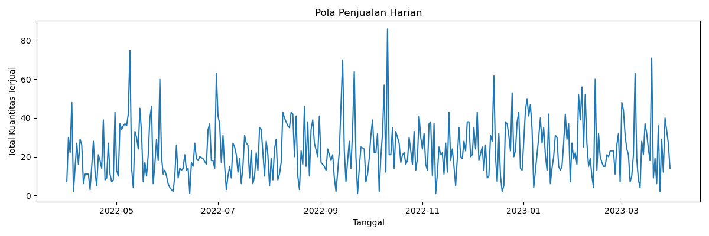
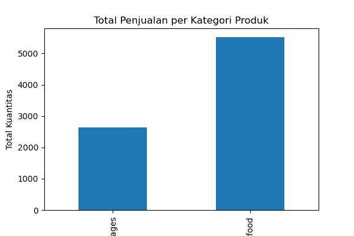
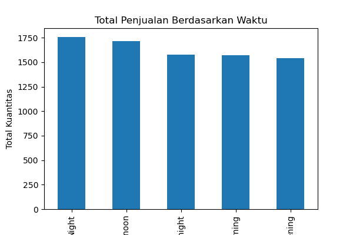

# 🍔 Analisis Pola Penjualan Fast Food

## Daftar Isi
- [Ringkasan Eksekutif](#ringkasan-eksekutif)
- [Latar Belakang](#latar-belakang)
- [Dataset](#dataset)
- [Metodologi Analisis](#metodologi-analisis)
- [Insight Utama & Visualisasi](#insight-utama--visualisasi)
  - [1. Pola Penjualan Berdasarkan Waktu](#1-pola-penjualan-berdasarkan-waktu)
  - [2. Kontribusi Produk terhadap Penjualan](#2-kontribusi-produk-terhadap-penjualan)
  - [3. Perbedaan Pola Berdasarkan Kategori Produk](#3-perbedaan-pola-berdasarkan-kategori-produk)
  - [4. Pengaruh Waktu Penjualan terhadap Volume](#4-pengaruh-waktu-penjualan-terhadap-volume)
  - [5. Pengaruh Channel Transaksi](#5-pengaruh-channel-transaksi)
- [Struktur Repository](#struktur-repository)
- [Penulis](#penulis)

---

## Ringkasan Eksekutif

Analisis ini dilakukan untuk memahami pola penjualan dan faktor operasional
pada sebuah outlet fast food berdasarkan data transaksi historis.
Tujuan utama analisis adalah mengidentifikasi insight yang relevan
untuk mendukung pengambilan keputusan operasional berbasis data,
khususnya terkait pengelolaan menu, waktu operasional, dan channel transaksi.

### Temuan Utama
- Penjualan harian menunjukkan fluktuasi yang sangat tinggi tanpa tren yang konsisten,
  sehingga perencanaan berbasis data harian memiliki risiko yang cukup besar.
- Sebagian kecil produk memberikan kontribusi signifikan terhadap total penjualan dan revenue,
  menunjukkan adanya pola Pareto (produk inti vs produk pendukung).
- Kategori **Fastfood** merupakan kontributor utama terhadap volume dan pendapatan,
  sementara **Beverages** memiliki rata-rata kuantitas per transaksi yang sedikit lebih tinggi.
- Waktu penjualan **Night** dan **Afternoon** cenderung lebih ramai,
  namun secara keseluruhan operasional relatif stabil sepanjang hari.
- Channel transaksi **Cash** masih mendominasi, sementara **Online**
  menunjukkan potensi untuk dikembangkan. Terdapat pula keterbatasan pencatatan data
  pada kategori **Unknown**.

### Rekomendasi Singkat
- Fokus pada produk inti dengan kontribusi penjualan tertinggi
- Optimalisasi kategori Fastfood sebagai penggerak utama bisnis
- Penyesuaian staffing dan stok pada periode Night dan Afternoon
- Pengembangan channel Online dan perbaikan kualitas pencatatan data

---

## Latar Belakang

Bisnis fast food memiliki karakteristik permintaan yang fluktuatif dan sangat dipengaruhi
oleh faktor operasional harian. Oleh karena itu, analisis data transaksi historis
dapat memberikan insight penting untuk meningkatkan efisiensi operasional
dan kualitas pengambilan keputusan berbasis data.

---

## Dataset

- **Sumber**: Dataset transaksi penjualan fast food
- **Jumlah data**: 1.000 transaksi
- **Fitur utama**:
  - Tanggal transaksi
  - Nama dan kategori produk
  - Harga dan kuantitas
  - Revenue transaksi
  - Waktu penjualan
  - Channel transaksi

---

## Metodologi Analisis

Pendekatan yang digunakan adalah **analisis deskriptif dan diagnostik**, meliputi:
- Pembersihan dan normalisasi data
- Agregasi penjualan berdasarkan waktu
- Analisis kontribusi produk dan kategori
- Analisis pola berdasarkan waktu penjualan dan channel transaksi

Tidak digunakan model prediktif, karena data tidak menunjukkan pola musiman
yang cukup kuat untuk peramalan yang stabil.

---

## Insight Utama & Visualisasi

### 1. Pola Penjualan Berdasarkan Waktu
Penjualan harian bersifat sangat fluktuatif tanpa tren yang konsisten.



---

### 2. Kontribusi Produk terhadap Penjualan
Sebagian kecil produk memberikan kontribusi besar terhadap total penjualan dan revenue.
Produk dengan volume tinggi tidak selalu menghasilkan revenue tertinggi,
menunjukkan perbedaan peran produk dalam bisnis.

---

### 3. Perbedaan Pola Berdasarkan Kategori Produk
Kategori **Fastfood** mendominasi total kuantitas dan revenue dibandingkan **Beverages**,
sementara Beverages memiliki rata-rata kuantitas per transaksi yang sedikit lebih tinggi.



---

### 4. Pengaruh Waktu Penjualan terhadap Volume
Periode **Night** dan **Afternoon** memiliki volume penjualan yang relatif lebih tinggi,
namun secara keseluruhan distribusi penjualan cukup stabil sepanjang hari.



---

### 5. Pengaruh Channel Transaksi
Transaksi **Cash** masih menjadi kanal utama penjualan,
sementara **Online** menunjukkan potensi untuk dikembangkan.
Kategori **Unknown** mengindikasikan perlunya perbaikan kualitas pencatatan data.

---

## Struktur Repository

```text
fastfood-sales-analysis/
│
├── data/
│   └── Balaji Fast Food Sales.csv
│
├── images/
│   ├── daily_sales.png
│   ├── category_summary.png
│   └── time_summary.png
│
├── notebook/
│   └── fastfood_sales_analysis.ipynb
│
├── requirements.txt
├── environment.yml

└── readme.md
````

---

## Penulis
**Muhammad Luthfi**  
S1 Teknik Informatika – Universitas Muhammadiyah Malang  
Fokus: Data Analysis & Data Engineering

